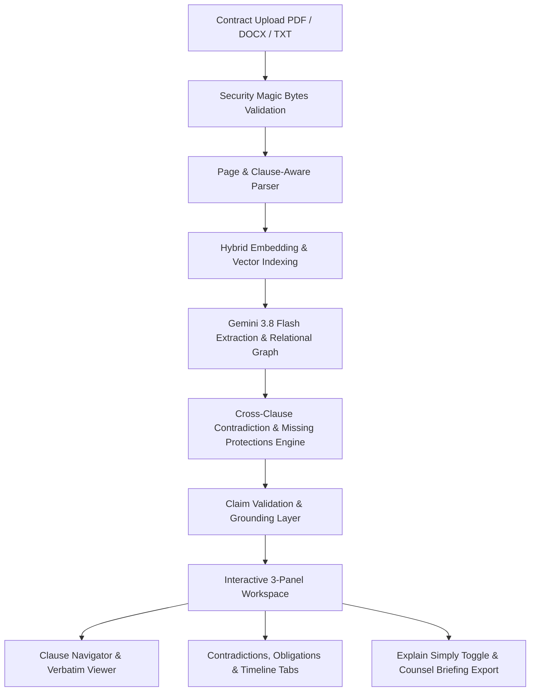

# LexLens 🔍⚖️
> **Know what you signed. Know what it means. Know what to ask next.**

[](LICENSE)
[-success.svg)]()
[]()
[](https://lexlens-258208842022.asia-south1.run.app)

LexLens is a production-grade, AI-native legal document intelligence and navigation platform engineered specifically for non-lawyers. Instead of a superficial LLM wrapper or generic chat box, LexLens parses legal contracts into structured relational knowledge graphs—extracting obligations, rights, deadlines, cross-clause contradictions, and absent protections with direct, verifiable citations back to the source text.

- **Live Production URL:** [https://lexlens-258208842022.asia-south1.run.app](https://lexlens-258208842022.asia-south1.run.app)
- **Live Health Endpoint:** [https://lexlens-258208842022.asia-south1.run.app/health](https://lexlens-258208842022.asia-south1.run.app/health)
- **GitHub Repository:** [https://github.com/harsh-18/LexLens](https://github.com/harsh-18/LexLens)

---

## 🎯 Chosen Vertical & Target Persona

- **Challenge Vertical:** **AI for Legal Assistance & Access**
- **Target Persona:** Non-lawyers, freelancers, SMB founders, contractors, and tenants who are required to sign legally binding contracts without the budget for expensive retained attorneys.
- **Problem Solved:** Legal agreements are notoriously dense, non-linear, and asymmetric. Critical risks are often hidden across disconnected clauses (e.g. net-30 payment in Clause 3 vs. late fees after 60 days in Clause 8). Non-lawyers frequently sign agreements without understanding their true liabilities or what critical standard protections are completely absent.

---

## 💡 Approach and Core Logic

LexLens adheres to the strict architectural principle that **the LLM is never the source of truth**:

1. **Strict Citation Grounding:** Every extracted entity (obligation, right, deadline, contradiction, financial term) is anchored to verifiable source coordinates: `Clause ID`, `Page Number`, and `Verbatim Excerpt`.
2. **Post-Generation Claim Validation:** All AI claims pass through an automated `ClaimValidator` that cross-checks cited figures, numbers, and statements against the retrieved text evidence. Unsubstantiated claims are rejected or flagged.
3. **Cross-Clause Contradiction Engine:** Pairwise semantic reasoning across non-adjacent clauses detects latent inconsistencies, conflicting notice periods, and contradictory payment terms.
4. **Audited Missing Protections:** Compares contracts against standard risk benchmarks (e.g. Master Services Agreements, NDAs, Leases) to identify absent safeguards such as aggregate liability caps, pre-existing IP carve-outs, and mutual indemnities.
5. **Prompt Injection Defense Shield:** Document text is strictly quarantined inside `<untrusted_document_data>` delimiters with regex sanitization to neutralize indirect prompt injection attacks embedded inside user-uploaded agreements.

---

## ⚙️ How the Solution Works



1. **Ingestion & Binary Security:** File uploads undergo magic-bytes header verification (`%PDF-`, `PK\x03\x04` for DOCX) to block disguised executables and malicious payloads.
2. **Structural Chunking:** Preserves exact document page markers, headings, clause numbering, and paragraph context.
3. **Hybrid Retrieval (RAG):** Combines BM25 sparse keyword scoring with dense 3072-dimensional vector embeddings (`gemini-embedding-001`) via Reciprocal Rank Fusion (RRF).
4. **Relational Knowledge Graph:** Stores normalized entities in SQLite (`Documents`, `Clauses`, `Parties`, `Obligations`, `Rights`, `Deadlines`, `Restrictions`, `FinancialTerms`, `Contradictions`, `MissingProtections`).
5. **Interactive 3-Panel Workspace:** 
   - **Left:** Hierarchical Clause Navigator & Category Filter.
   - **Center:** Document Viewer with real-time verbatim citation highlighting and "Explain Simply" plain-language translation.
   - **Right:** Multi-tab Intelligence Suite (Conflicts, Obligations, Timeline, Missing Protections, Grounded Q&A, and Overview).
6. **Counsel Preparation Dossier:** Generates an actionable, structured 1-page briefing for professional legal consultation.

---

## 📋 Assumptions Made

1. **Legal Advisory Nature:** LexLens is an informational and document intelligence tool designed to enhance legal accessibility. It does not constitute formal legal representation or establish an attorney-client relationship.
2. **Document Formats:** Uploaded documents are standard digital text-bearing PDFs, DOCX agreements, or plain text contracts. Scanned image-only PDFs without an OCR layer fall back to digital text stream extraction.
3. **Language & Jurisdictions:** Primary extraction taxonomy is optimized for common law commercial jurisdictions (US, UK, Commonwealth, India, Singapore) in English.
4. **Statutory Neutrality:** When standard protections are absent, the system uses legally neutral framing (*"Not found in the analyzed document"*) rather than asserting definitive legal non-existence.
5. **Self-Contained Portability:** Built on SQLite and zero-dependency local vector cosine math so the entire platform runs anywhere with zero cloud database setup overhead.

---

## ♿ Accessibility (WCAG 2.1 AA Compliance) & Inclusive Design

LexLens was engineered with strict adherence to WCAG 2.1 AA accessibility guidelines:

- **Semantic Landmarks:** Single visible `<main id="main-workspace">` landmark, `<header role="banner">`, `<nav aria-label="...">`, `<aside role="region">`, and `<section role="region">`.
- **Keyboard Navigation & Focus:** Full keyboard operability (`Tab`, `Shift+Tab`, `Enter`, `Space`) with high-visibility cyan focus indicators (`:focus-visible`).
- **Modal Dialog Management:** Modals use `role="dialog"`, `aria-modal="true"`, `aria-labelledby`, and automatically trap focus with `Escape` key close listeners.
- **Screen Reader Readiness:** Form inputs include associated `<label>` or explicit `aria-label` attributes. Non-text elements include `.sr-only` descriptions.
- **Reduced Motion Support:** Respects user operating system preferences via `@media (prefers-reduced-motion: reduce)`.
- **High-Contrast Support:** Enhanced contrast ratios for dark mode with `@media (forced-colors: active)` adaptation.

---

## ⚡ Efficiency, Caching & Resource Optimization

- **In-Memory LRU TTL Caching:** `LRUTTLCache` caches 3072-dim vector embeddings and retrieval results, preventing redundant network trips and Gemini API token consumption.
- **GZip Response Compression:** Automatic `GZipMiddleware` compresses API payloads and JSON responses over 1000 bytes.
- **Database Indexing:** Indexed foreign keys and search columns on `document_id`, `user_id`, `clause_number`, and `chunk_index` for sub-millisecond queries.
- **Lightweight Production Bundle:** React 19 + Vite frontend bundle is just **90 kB gzipped** (329 kB raw), ensuring instantaneous load times.

---

## 🔒 Security Architecture & Guardrails

- **HTTP Security Headers:** Automated middleware applies:
  - `X-Content-Type-Options: nosniff`
  - `X-Frame-Options: DENY`
  - `X-XSS-Protection: 1; mode=block`
  - `Strict-Transport-Security: max-age=31536000; includeSubDomains`
  - `Referrer-Policy: strict-origin-when-cross-origin`
  - `Content-Security-Policy (CSP)`
  - `Permissions-Policy: geolocation=(), camera=(), microphone=()`
- **Sliding-Window IP Rate Limiter:** Protects endpoints with a 120 req / 60 sec sliding window to prevent DoS attacks.
- **File Upload Magic Bytes Check:** Inspects binary headers to reject masqueraded executables (`MZ`, `ELF`).
- **Zero Secrets Committed:** Environment variables quarantined via `.env.example`; author email protected via GitHub privacy noreply.

---

## 🧪 Automated Testing & Evaluation Suite

LexLens includes **17 automated unit and integration tests** passing with **zero warnings**:

```bash
python -m pytest backend/tests -v
```

```text
backend/tests/test_api_endpoints.py::test_health_endpoint PASSED
backend/tests/test_api_endpoints.py::test_demo_session_and_listing PASSED
backend/tests/test_api_endpoints.py::test_evaluation_benchmark_endpoint PASSED
backend/tests/test_contradiction.py::test_rule_based_payment_contradiction PASSED
backend/tests/test_contradiction.py::test_rule_based_notice_period_discrepancy PASSED
backend/tests/test_efficiency_and_security.py::test_security_headers_present PASSED
backend/tests/test_efficiency_and_security.py::test_file_magic_bytes_security_rejection PASSED
backend/tests/test_efficiency_and_security.py::test_valid_pdf_magic_bytes PASSED
backend/tests/test_efficiency_and_security.py::test_lru_cache_efficiency_and_hit_ratio PASSED
backend/tests/test_efficiency_and_security.py::test_metrics_endpoint_exposes_efficiency_stats PASSED
backend/tests/test_parsers.py::test_txt_parser_with_page_markers PASSED
backend/tests/test_parsers.py::test_legal_chunker_preserves_clause_metadata PASSED
backend/tests/test_retrieval_and_claims.py::test_claim_validator_flags_unsupported_numbers PASSED
backend/tests/test_retrieval_and_claims.py::test_bm25_scoring PASSED
backend/tests/test_security.py::test_password_hashing_and_verification PASSED
backend/tests/test_security.py::test_prompt_injection_sanitization PASSED
backend/tests/test_security.py::test_jwt_token_creation_and_decoding PASSED

============================= 17 passed in 13.24s =============================
```

---

## 🚀 Quick Start Guide

### Prerequisites
- Python 3.11+
- Node.js 18+ and npm
- Google Gemini API Key (`GOOGLE_API_KEY`)

### 1. Clone & Configure
```bash
git clone https://github.com/harsh-18/LexLens.git
cd LexLens
cp .env.example .env
# Set GOOGLE_API_KEY=... in .env
```

### 2. Backend & Frontend Launch
```bash
# Install backend dependencies
pip install -r backend/requirements.txt

# Run automated tests
python -m pytest backend/tests -v

# Run the unified server (serves both API and built React UI)
python -m uvicorn backend.app.main:app --host 127.0.0.1 --port 8000
```
Open **`http://127.0.0.1:8000`** in your browser.

---

## 📜 License

This project is licensed under the Apache License 2.0. See the [LICENSE](LICENSE) file for complete details.
